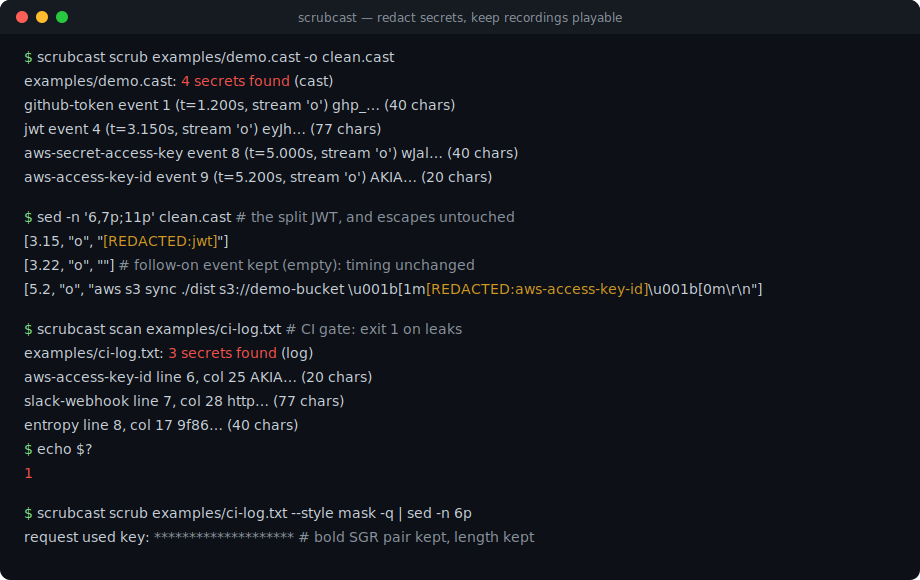
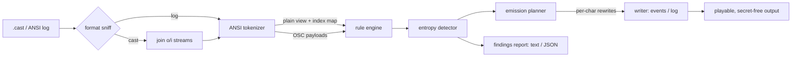

# scrubcast

[English](README.md) | [中文](README.zh.md) | [日本語](README.ja.md)

[](LICENSE) [](CHANGELOG.md) [](pyproject.toml)  [](CONTRIBUTING.md)

**ターミナル録画と ANSI ログのためのオープンソース秘匿化ツール — ルールとエントロピー検出、エスケープシーケンスを理解した置換で asciinema 録画は再生可能なまま。**



```bash
git clone https://github.com/JaydenCJ/scrubcast && cd scrubcast && pip install -e .
```

> **プレリリース:** scrubcast はまだ PyPI に公開されていません。初回リリースまでは [JaydenCJ/scrubcast](https://github.com/JaydenCJ/scrubcast) をクローンし、リポジトリのルートで `pip install -e .` を実行してください。ランタイム依存はゼロ — 標準ライブラリだけで動きます。

## なぜ scrubcast なのか？

asciinema のデモや貼り付けた CI ログからのトークン漏洩は後を絶ちませんが、それを防ぐはずのツールはソースコード向けに作られており、ターミナル向けではありません。ターミナルのデータはプレーンテキストではない：プロンプトテーマが `\x1b[1m…\x1b[0m` で包んだ GitHub トークンは、連続した文字を期待する正規表現には見えませんし、asciicast では同じトークンが大抵*複数イベントに分割*されています — キー入力ごとにエコーされたり、任意のチャンクでフラッシュされたり。gitleaks や trufflehog などのシークレットスキャナは検出はしても修復はせず、`.cast` ファイルに `sed` をかければ、装飾されたシークレットを見逃すか、JSON とエスケープバイトを壊して録画が再生できなくなります。scrubcast はまず ANSI 層をトークナイズします：検出はターミナルが*実際に描画する*内容の上で走り、置換はエスケープバイトに一切触れずに書き戻され、asciicast のストリームは一つの論理文字列として洗浄されるため、イベントをまたぐシークレットも捕捉され、すべてのイベント・タイムスタンプ・色が無傷で残ります。

| | scrubcast | gitleaks | trufflehog | sed / 手作業編集 |
|---|---|---|---|---|
| ANSI エスケープコードで分断されたシークレットに一致 | ○ | × | × | × |
| 複数の asciicast イベントに分割されたシークレットに一致 | ○ | × | × | × |
| 報告だけでなく修復する | ○ | × | × | ○ |
| 出力は再生可能な asciicast のまま（イベント・タイミング・色） | ○ | 対象外 | 対象外 | タイポ一つで崩壊 |
| エントロピー検出 + 16進ダイジェストへのキーワード文脈 | ○ | ルール + エントロピー | 検出器 + 検証 | × |
| ランタイム依存 | 0 | Go バイナリ | Go バイナリ | 0 |

<sub>機能比較は各ツールの公開ドキュメントと、装飾/チャンク化された入力に対する実挙動を 2026-07 に確認したもの。scrubcast の依存数は [pyproject.toml](pyproject.toml) の `dependencies = []` の通りです。</sub>

## 特長

- **エスケープシーケンスを理解した置換** — マッチ前に CSI・OSC・DCS・途中で切れたシーケンスをトークナイズして分離するため、色コードに分断されたトークンも一致し、コード自体は書き換え後もそのまま残ります。
- **asciicast のイベント横断秘匿化** — `"o"` と `"i"` の各ストリームを一つの論理文字列として洗浄してからイベント単位で再構築：1 キー 1 イベントで打たれたシークレットも捕捉し、イベント数・順序・タイムスタンプはバイト単位で不変です。
- **18 のシェイプルール + 誠実なエントロピー** — AWS、GitHub、GitLab、Slack、Stripe、JWT、PEM ブロック、`Authorization:` ヘッダ、URL パスワード、`KEY=value` 代入など；エントロピー検出器は 16 進の近くに資格情報キーワードがあるときだけ警告するため、git SHA や docker ダイジェストは静かなままです。
- **3 種類のプレースホルダ** — 読みやすい `[REDACTED:rule]` ラベル、同一シークレットの反復を関連付けられる安定ハッシュタグ、桁揃えを保つ等長マスク。
- **決して漏らさない CI ゲート** — `scrubcast scan` は検出時に終了コード 1；レポート（テキストまたは `--json`）に含まれるのはルール名・行/イベント位置・4 文字プレビューのみ — シークレット本体は決して含まれません。
- **依存ゼロ・完全オフライン** — 純粋な Python 標準ライブラリで、どこにもネットワーク呼び出しなし；シークレットを扱うツールは一目で監査できるべきです。

## クイックスタート

インストール：

```bash
git clone https://github.com/JaydenCJ/scrubcast && cd scrubcast && pip install -e .
```

同梱のサンプル録画を洗浄します（4 つのシークレットが漏れており、1 つは 2 イベントに分割、1 つは OSC ウィンドウタイトルの中に隠れています）：

```bash
scrubcast scrub examples/demo.cast -o clean.cast
```

```text
examples/demo.cast: 4 secrets found (cast)
  github-token             event 1 (t=1.200s, stream 'o')       ghp_… (40 chars)
  jwt                      event 4 (t=3.150s, stream 'o')       eyJh… (77 chars)
  aws-secret-access-key    event 8 (t=5.000s, stream 'o')       wJal… (40 chars)
  aws-access-key-id        event 9 (t=5.200s, stream 'o')       AKIA… (20 chars)
```

`clean.cast` の再生はオリジナルと完全に同じ — 同じイベント、同じタイミング、同じ色。そのうち 3 行（`sed -n '6,7p;11p' clean.cast`）に難所が 2 つとも現れます：イベント分割された JWT は開始イベントに畳み込まれ — 後続イベントは空のまま残るのでタイミングは不変 — AWS キーを包む太字ペアもバイト単位で生き残ります：

```text
[3.15, "o", "[REDACTED:jwt]"]
[3.22, "o", ""]
[5.2, "o", "aws s3 sync ./dist s3://demo-bucket \u001b[1m[REDACTED:aws-access-key-id]\u001b[0m\r\n"]
```

CI ログを issue に貼る前にゲートを通します — 終了コード 1 は漏洩ありの意味：

```bash
scrubcast scan examples/ci-log.txt; echo "exit: $?"
```

```text
examples/ci-log.txt: 3 secrets found (log)
  aws-access-key-id        line 6, col 25                       AKIA… (20 chars)
  slack-webhook            line 7, col 28                       http… (77 chars)
  entropy                  line 8, col 17                       9f86… (40 chars)
exit: 1
```

## 検出リファレンス

`scrubcast rules` は 18 の組み込みルールをすべて一覧表示します：`private-key-block`、`aws-access-key-id`、`aws-secret-access-key`、`github-token`、`gitlab-token`、`slack-token`、`slack-webhook`、`stripe-key`、`sk-api-key`、`google-api-key`、`npm-token`、`pypi-token`、`sendgrid-key`、`age-secret-key`、`jwt`、`authorization-header`、`url-userinfo`、`secret-assignment` — 加えて `entropy` 検出器。すべてフラグ（`--disable`、`--allow`、`--no-entropy`）または JSON ルールファイル（`--rules`、[`examples/scrubcast-rules.json`](examples/scrubcast-rules.json) 参照）で調整できます：

| キー | 既定値 | 効果 |
|---|---|---|
| `rules` | `[]` | 追加ルール。各要素は `{"name", "pattern", "description"}`；`(?P<secret>…)` はそのグループのみ秘匿化 |
| `disable` | `[]` | 無効化する組み込みルール名 |
| `allow` | `[]` | 正規表現のリスト；シークレットが一致した検出は破棄（既知のダミー値） |
| `entropy.min_length` | `20` | エントロピー検出器が考慮する最短の候補長 |
| `entropy.threshold` | `4.0` | 混合アルファベット候補に必要な bits/char |
| `entropy.hex_threshold` | `3.0` | 16 進候補の bits/char（さらに近くに資格情報キーワードが必要） |
| `entropy.context_window` | `40` | `token`・`secret`・`key` などのキーワードを何文字さかのぼって探すか |

## プレースホルダのスタイル

| スタイル | 出力 | 特性 |
|---|---|---|
| `label`（既定） | `[REDACTED:github-token]` | 読みやすく、何を消したかが分かる |
| `hash` | `[REDACTED:github-token:1a2b3c4d]` | 同一シークレット ⇒ 同一タグ。洗浄後のログも grep で関連付け可能（ソルトなし SHA-256 の先頭 8 桁 — 相関 id であって暗号化ではない） |
| `mask` | `**********` | 等長保持：桁揃えとバイト数が不変。桁の揃った TUI 出力の録画に最適 |

置換モデルの全容 — プレーンビューのインデックスマップ、文字単位のエミッションテーブル、録画が再生可能なままである理由 — は [`docs/redaction-model.md`](docs/redaction-model.md) に記載しています。

## 検証

このリポジトリは CI を同梱していません。上記の主張はすべてローカル実行で検証されています。このリポジトリのチェックアウトから再現できます：

```bash
pip install -e '.[dev]' && pytest && bash scripts/smoke.sh
```

出力（実際の実行からコピーし、`...` で省略）：

```text
91 passed in 1.04s
...
[scrub] examples/demo.cast: 4 secrets found (cast)
SMOKE OK
```

## アーキテクチャ



## ロードマップ

- [x] ANSI トークナイザ、18 ルール + エントロピー、3 スタイル、asciicast のイベント横断秘匿化、ルールファイル、CI ゲート付き CLI（v0.1.0）
- [ ] ストリーミングモード：`tee` 型パイプライン向けに有界ルックバックで stdin を洗浄
- [ ] asciicast v3 と ttyrec 入力フォーマットへの対応
- [ ] 検証フック：警告前に候補が現在も有効かを任意で確認（オプトイン、明示的にネットワーク使用）
- [ ] PyPI へのリリース、`pip install scrubcast`

全リストは [open issues](https://github.com/JaydenCJ/scrubcast/issues) を参照してください。

## コントリビュート

コントリビューション歓迎です — [good first issue](https://github.com/JaydenCJ/scrubcast/issues?q=is%3Aissue+is%3Aopen+label%3A%22good+first+issue%22) から始めるか、[discussion](https://github.com/JaydenCJ/scrubcast/discussions) を立ててください。開発環境の構築は [CONTRIBUTING.md](CONTRIBUTING.md) を参照。

## ライセンス

[MIT](LICENSE)
