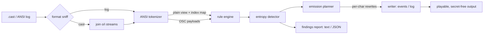

# scrubcast

[English](README.md) | [中文](README.zh.md) | [日本語](README.ja.md)

[](LICENSE) [](CHANGELOG.md) [](pyproject.toml)  [](CONTRIBUTING.md)

**Open-source redaction for terminal recordings and ANSI logs — rules plus entropy detection, with escape-sequence-aware replacement that keeps asciinema casts playable.**


```bash
git clone https://github.com/JaydenCJ/scrubcast && cd scrubcast && pip install -e .
```

> **Pre-release:** scrubcast is not yet published to PyPI. Until the first release, clone [JaydenCJ/scrubcast](https://github.com/JaydenCJ/scrubcast) and run `pip install -e .` from the repository root. Zero runtime dependencies — the standard library is all it needs.

## Why scrubcast?

People leak tokens in asciinema demos and pasted CI logs constantly, and the tools that should catch it were built for source code, not terminals. Terminal data is not plain text: a GitHub token wrapped in `\x1b[1m…\x1b[0m` by a prompt theme is invisible to a regex that expects contiguous characters, and in an asciicast the same token is usually *split across events* — echoed keystroke by keystroke or flushed in arbitrary chunks. Secret scanners like gitleaks and trufflehog detect but do not repair, and running `sed` over a `.cast` file either misses the styled secret or mangles the JSON and escape bytes so the recording no longer plays. scrubcast tokenizes the ANSI layer first: detection runs on what the terminal *renders*, replacement is applied back without touching a single escape byte, and asciicast streams are scrubbed as one logical string so cross-event secrets are caught while every event, timestamp, and color survives.

| | scrubcast | gitleaks | trufflehog | sed / hand-editing |
|---|---|---|---|---|
| Matches secrets split by ANSI escape codes | Yes | No | No | No |
| Matches secrets split across asciicast events | Yes | No | No | No |
| Repairs, not just reports | Yes | No | No | Yes |
| Output stays a playable asciicast (events, timing, colors) | Yes | n/a | n/a | One typo away |
| Entropy detection with keyword context for hex digests | Yes | Rules + entropy | Detectors + verification | No |
| Runtime dependencies | 0 | Go binary | Go binary | 0 |

<sub>Capability claims checked against each tool's public documentation and behavior on styled/chunked input, 2026-07. scrubcast's dependency count is `dependencies = []` in [pyproject.toml](pyproject.toml).</sub>

## Features

- **Escape-sequence-aware replacement** — CSI, OSC, DCS, and truncated sequences are tokenized out before matching, so a token interrupted by color codes still matches and the codes survive the rewrite verbatim.
- **Cross-event redaction for asciicasts** — `"o"` and `"i"` streams are scrubbed as one logical string and rebuilt per event: a secret typed one keystroke per event is caught, and event count, order, and timestamps are byte-identical.
- **18 shape rules + honest entropy** — AWS, GitHub, GitLab, Slack, Stripe, JWT, PEM blocks, `Authorization:` headers, URL passwords, `KEY=value` assignments and more; the entropy detector requires a credential keyword before flagging hex, so git SHAs and docker digests stay quiet.
- **Three placeholder styles** — readable `[REDACTED:rule]` labels, stable hash tags that correlate repeated occurrences of the same secret, or length-preserving masking that keeps column alignment intact.
- **A CI gate that never leaks** — `scrubcast scan` exits 1 on findings; reports (text or `--json`) contain rule names, line/event locations, and 4-char previews — never the secret itself.
- **Zero dependencies, fully offline** — pure Python standard library, no network calls anywhere; a tool that handles secrets should be auditable at a glance.

## Quickstart

Install:

```bash
git clone https://github.com/JaydenCJ/scrubcast && cd scrubcast && pip install -e .
```

Scrub the bundled example recording (it leaks four secrets, one of them split across two events and one hidden in an OSC window title):

```bash
scrubcast scrub examples/demo.cast -o clean.cast
```

```text
examples/demo.cast: 4 secrets found (cast)
  github-token             event 1 (t=1.200s, stream 'o')       ghp_… (40 chars)
  jwt                      event 4 (t=3.150s, stream 'o')       eyJh… (77 chars)
  aws-secret-access-key    event 8 (t=5.000s, stream 'o')       wJal… (40 chars)
  aws-access-key-id        event 9 (t=5.200s, stream 'o')       AKIA… (20 chars)
```

`clean.cast` plays back exactly like the original — same events, same timing, same colors. Three of its lines (`sed -n '6,7p;11p' clean.cast`) show the two hard cases: the event-split JWT collapses into the event where it starts — the follow-on event stays, empty, so timing is untouched — and the bold pair around the AWS key survives byte-for-byte:

```text
[3.15, "o", "[REDACTED:jwt]"]
[3.22, "o", ""]
[5.2, "o", "aws s3 sync ./dist s3://demo-bucket \u001b[1m[REDACTED:aws-access-key-id]\u001b[0m\r\n"]
```

Gate a CI log before pasting it into an issue — exit code 1 means it leaks:

```bash
scrubcast scan examples/ci-log.txt; echo "exit: $?"
```

```text
examples/ci-log.txt: 3 secrets found (log)
  aws-access-key-id        line 6, col 25                       AKIA… (20 chars)
  slack-webhook            line 7, col 28                       http… (77 chars)
  entropy                  line 8, col 17                       9f86… (40 chars)
exit: 1
```

## Detection reference

`scrubcast rules` lists all 18 built-in rules: `private-key-block`, `aws-access-key-id`, `aws-secret-access-key`, `github-token`, `gitlab-token`, `slack-token`, `slack-webhook`, `stripe-key`, `sk-api-key`, `google-api-key`, `npm-token`, `pypi-token`, `sendgrid-key`, `age-secret-key`, `jwt`, `authorization-header`, `url-userinfo`, and `secret-assignment` — plus the `entropy` detector. Tune everything with flags (`--disable`, `--allow`, `--no-entropy`) or a JSON rules file (`--rules`, see [`examples/scrubcast-rules.json`](examples/scrubcast-rules.json)):

| Key | Default | Effect |
|---|---|---|
| `rules` | `[]` | extra rules, each `{"name", "pattern", "description"}`; `(?P<secret>…)` redacts only that group |
| `disable` | `[]` | built-in rule names to turn off |
| `allow` | `[]` | regexes; findings whose secret matches are dropped (known-fake values) |
| `entropy.min_length` | `20` | shortest candidate the entropy detector considers |
| `entropy.threshold` | `4.0` | bits/char required for mixed-alphabet candidates |
| `entropy.hex_threshold` | `3.0` | bits/char for hex candidates (which also need a nearby credential keyword) |
| `entropy.context_window` | `40` | how far back (chars) to look for keywords like `token`, `secret`, `key` |

## Placeholder styles

| Style | Output | Property |
|---|---|---|
| `label` (default) | `[REDACTED:github-token]` | readable; says what was removed |
| `hash` | `[REDACTED:github-token:1a2b3c4d]` | same secret ⇒ same tag, so scrubbed logs stay grep-ably correlatable (truncated unsalted SHA-256 — a correlation id, not encryption) |
| `mask` | `**********` | length-preserving: column alignment and byte counts survive, ideal for recordings of aligned TUI output |

The full replacement model — plain-view index maps, the per-character emission table, why casts stay playable — is documented in [`docs/redaction-model.md`](docs/redaction-model.md).

## Verification

This repository ships no CI; every claim above is verified by local runs. Reproduce them from a checkout of this repository:

```bash
pip install -e '.[dev]' && pytest && bash scripts/smoke.sh
```

Output (copied from a real run, truncated with `...`):

```text
91 passed in 1.04s
...
[scrub] examples/demo.cast: 4 secrets found (cast)
SMOKE OK
```

## Architecture



## Roadmap

- [x] ANSI tokenizer, 18 rules + entropy, three styles, asciicast cross-event scrubbing, rules files, CLI with CI gate (v0.1.0)
- [ ] Streaming mode: scrub stdin with bounded lookback for `tee`-style pipelines
- [ ] asciicast v3 and ttyrec input formats
- [ ] Verification hooks: optionally confirm a candidate is live before flagging (opt-in, explicitly networked)
- [ ] PyPI release with `pip install scrubcast`

See the [open issues](https://github.com/JaydenCJ/scrubcast/issues) for the full list.

## Contributing

Contributions are welcome — start with a [good first issue](https://github.com/JaydenCJ/scrubcast/issues?q=is%3Aissue+is%3Aopen+label%3A%22good+first+issue%22) or open a [discussion](https://github.com/JaydenCJ/scrubcast/discussions). See [CONTRIBUTING.md](CONTRIBUTING.md) for the development setup.

## License

[MIT](LICENSE)
