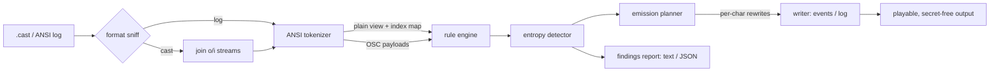

# scrubcast

[English](README.md) | [中文](README.zh.md) | [日本語](README.ja.md)

[](LICENSE) [](CHANGELOG.md) [](pyproject.toml)  [](CONTRIBUTING.md)

**开源的终端录像与 ANSI 日志脱敏工具——规则加信息熵检测，感知转义序列的替换让 asciinema 录像依然可以播放。**


```bash
git clone https://github.com/JaydenCJ/scrubcast && cd scrubcast && pip install -e .
```

> **预发布：** scrubcast 尚未发布到 PyPI。在首个正式版之前，请克隆 [JaydenCJ/scrubcast](https://github.com/JaydenCJ/scrubcast) 并在仓库根目录执行 `pip install -e .`。零运行时依赖——只需要标准库。

## 为什么选择 scrubcast？

人们不断在 asciinema 演示和贴出的 CI 日志里泄露 token，而本该拦住它的工具是为源代码而不是终端设计的。终端数据不是纯文本：被提示符主题包在 `\x1b[1m…\x1b[0m` 里的 GitHub token，对期待字符连续的正则来说是不可见的；而在 asciicast 中，同一个 token 通常还被*拆散在多个事件里*——按键逐个回显，或按任意块大小刷出。gitleaks、trufflehog 之类的密钥扫描器只检测不修复；对 `.cast` 文件跑 `sed`，要么漏掉带样式的密钥，要么把 JSON 和转义字节改坏，录像就再也放不了了。scrubcast 先对 ANSI 层做分词：检测跑在终端*实际渲染*的内容上，替换写回去时不动任何一个转义字节，asciicast 流被当作一个逻辑字符串来清洗，跨事件的密钥被抓住，而每个事件、每个时间戳、每种颜色都完好保留。

| | scrubcast | gitleaks | trufflehog | sed / 手工编辑 |
|---|---|---|---|---|
| 匹配被 ANSI 转义码拆开的密钥 | 是 | 否 | 否 | 否 |
| 匹配被拆到多个 asciicast 事件里的密钥 | 是 | 否 | 否 | 否 |
| 修复，而不只是报告 | 是 | 否 | 否 | 是 |
| 输出仍是可播放的 asciicast（事件、时序、颜色） | 是 | 不适用 | 不适用 | 一个笔误就毁 |
| 信息熵检测 + 十六进制摘要的关键词上下文 | 是 | 规则 + 熵 | 检测器 + 验证 | 否 |
| 运行时依赖 | 0 | Go 二进制 | Go 二进制 | 0 |

<sub>能力对比核对自各工具的公开文档及其在带样式/分块输入上的实际行为，2026-07。scrubcast 的依赖数即 [pyproject.toml](pyproject.toml) 中的 `dependencies = []`。</sub>

## 功能

- **感知转义序列的替换** —— 匹配前先把 CSI、OSC、DCS 以及被截断的序列分词剥离，被颜色码打断的 token 照样命中，且这些转义码在改写后原样保留。
- **asciicast 跨事件脱敏** —— `"o"` 与 `"i"` 流各自拼成一个逻辑字符串清洗后再按事件重建：一键一个事件敲出的密钥也能抓到，事件数量、顺序与时间戳逐字节不变。
- **18 条形状规则 + 诚实的熵检测** —— AWS、GitHub、GitLab、Slack、Stripe、JWT、PEM 块、`Authorization:` 头、URL 密码、`KEY=value` 赋值等等；熵检测器要求十六进制附近出现凭据关键词才报警，git SHA 和 docker 摘要因此保持安静。
- **三种占位符风格** —— 可读的 `[REDACTED:rule]` 标签、让同一密钥反复出现时可关联的稳定哈希标签、或保持列对齐的等长掩码。
- **绝不泄密的 CI 闸门** —— `scrubcast scan` 发现问题即以 1 退出；报告（文本或 `--json`）只含规则名、行/事件位置和 4 字符预览——绝不含密钥本身。
- **零依赖、完全离线** —— 纯 Python 标准库，任何地方都没有网络调用；处理密钥的工具就该一眼可审计。

## 快速上手

安装：

```bash
git clone https://github.com/JaydenCJ/scrubcast && cd scrubcast && pip install -e .
```

清洗自带的示例录像（它泄露了四个密钥，其中一个横跨两个事件，另一个藏在 OSC 窗口标题里）：

```bash
scrubcast scrub examples/demo.cast -o clean.cast
```

```text
examples/demo.cast: 4 secrets found (cast)
  github-token             event 1 (t=1.200s, stream 'o')       ghp_… (40 chars)
  jwt                      event 4 (t=3.150s, stream 'o')       eyJh… (77 chars)
  aws-secret-access-key    event 8 (t=5.000s, stream 'o')       wJal… (40 chars)
  aws-access-key-id        event 9 (t=5.200s, stream 'o')       AKIA… (20 chars)
```

`clean.cast` 的回放与原始录像完全一致——同样的事件、同样的时序、同样的颜色。看其中三行（`sed -n '6,7p;11p' clean.cast`）就是两个最难的场景：被拆开的 JWT 收拢进它开始的那个事件——后续事件保留为空，时序因此分毫不动——包住 AWS key 的粗体配对也逐字节幸存：

```text
[3.15, "o", "[REDACTED:jwt]"]
[3.22, "o", ""]
[5.2, "o", "aws s3 sync ./dist s3://demo-bucket \u001b[1m[REDACTED:aws-access-key-id]\u001b[0m\r\n"]
```

在把 CI 日志贴进 issue 之前先做把关——退出码 1 表示有泄露：

```bash
scrubcast scan examples/ci-log.txt; echo "exit: $?"
```

```text
examples/ci-log.txt: 3 secrets found (log)
  aws-access-key-id        line 6, col 25                       AKIA… (20 chars)
  slack-webhook            line 7, col 28                       http… (77 chars)
  entropy                  line 8, col 17                       9f86… (40 chars)
exit: 1
```

## 检测参考

`scrubcast rules` 列出全部 18 条内置规则：`private-key-block`、`aws-access-key-id`、`aws-secret-access-key`、`github-token`、`gitlab-token`、`slack-token`、`slack-webhook`、`stripe-key`、`sk-api-key`、`google-api-key`、`npm-token`、`pypi-token`、`sendgrid-key`、`age-secret-key`、`jwt`、`authorization-header`、`url-userinfo`、`secret-assignment`——外加 `entropy` 检测器。一切都可以用命令行开关（`--disable`、`--allow`、`--no-entropy`）或 JSON 规则文件（`--rules`，见 [`examples/scrubcast-rules.json`](examples/scrubcast-rules.json)）调节：

| 键 | 默认值 | 作用 |
|---|---|---|
| `rules` | `[]` | 追加规则，每条为 `{"name", "pattern", "description"}`；`(?P<secret>…)` 只脱敏该分组 |
| `disable` | `[]` | 要关闭的内置规则名 |
| `allow` | `[]` | 正则列表；密钥匹配到即丢弃该发现（已知的假值） |
| `entropy.min_length` | `20` | 熵检测器考虑的最短候选长度 |
| `entropy.threshold` | `4.0` | 混合字母表候选所需的比特/字符 |
| `entropy.hex_threshold` | `3.0` | 十六进制候选的比特/字符（同时还需要附近有凭据关键词） |
| `entropy.context_window` | `40` | 向前回看多少字符寻找 `token`、`secret`、`key` 等关键词 |

## 占位符风格

| 风格 | 输出 | 特性 |
|---|---|---|
| `label`（默认） | `[REDACTED:github-token]` | 可读；说明删掉的是什么 |
| `hash` | `[REDACTED:github-token:1a2b3c4d]` | 同一密钥 ⇒ 同一标签，清洗后的日志仍可用 grep 关联（截断的无盐 SHA-256——是关联 id，不是加密） |
| `mask` | `**********` | 等长保留：列对齐与字节数不变，最适合对齐的 TUI 输出录像 |

完整的替换模型——明文视图索引映射、逐字符发射表、录像为何依然可播——见 [`docs/redaction-model.md`](docs/redaction-model.md)。

## 验证

本仓库不带任何 CI；上面的每一条声明都由本地运行验证。从本仓库的检出即可复现：

```bash
pip install -e '.[dev]' && pytest && bash scripts/smoke.sh
```

输出（摘自真实运行，用 `...` 截断）：

```text
91 passed in 1.04s
...
[scrub] examples/demo.cast: 4 secrets found (cast)
SMOKE OK
```

## 架构



## 路线图

- [x] ANSI 分词器、18 条规则 + 熵检测、三种风格、asciicast 跨事件脱敏、规则文件、带 CI 闸门的 CLI（v0.1.0）
- [ ] 流式模式：以有界回看清洗 stdin，适配 `tee` 式管道
- [ ] 支持 asciicast v3 与 ttyrec 输入格式
- [ ] 验证钩子：可选地在报警前确认候选是否仍有效（选择加入，显式联网）
- [ ] 发布到 PyPI，`pip install scrubcast`

完整列表见 [open issues](https://github.com/JaydenCJ/scrubcast/issues)。

## 参与贡献

欢迎贡献——从 [good first issue](https://github.com/JaydenCJ/scrubcast/issues?q=is%3Aissue+is%3Aopen+label%3A%22good+first+issue%22) 入手，或发起一个 [discussion](https://github.com/JaydenCJ/scrubcast/discussions)。开发环境搭建见 [CONTRIBUTING.md](CONTRIBUTING.md)。

## 许可证

[MIT](LICENSE)
